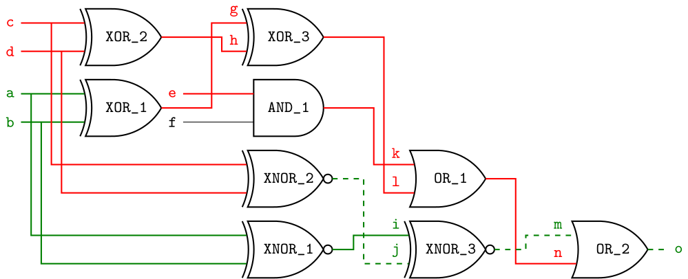

# Automatic Test Pattern Generation
This repository implements a couple of ATPG algorithms for digital circuits,
namely the **D-Algorithm** (and the *PODEM*). The implementation is based on
a lecture I attended during my course of study (Robust System Design).

</img>

## What is ATPG?
ATPG stands for **Automatic Test Pattern Generation** and is a method to
generate test patterns for digital circuits. The goal is to find a test
pattern that activates a faulty circuit in a way that the fault becomes
observable at the output of the circuit. The test pattern is then used to
test the circuit for the presence of the fault.

A *fault* here is modeled as a stuck-at fault, i.e. a fault that causes a
wire to be stuck at a certain value (0 or 1). The fault is *detected* if the
output of the circuit is different from the expected output.

A *test pattern* is a vector of input values that is applied to the circuit
to test it for the presence of a fault. Notably the values of the test pattern
can be either 0, 1 or X (unknown / don't care).

The generation procedure of such test patterns needs to do the following:
1. Set the values necessary to activate & propagate the fault on the modeled 
   faulty line.
2. *Imply* values for all other possible lines from the current line value
   assignments.
3. Check if the fault is detected. If not we need to check arbitrary assignments
   on all the lines which are not yet assigned such that the fault is further
   *propagated* and it's activating signals are *justified*.
4. If the fault is still not detected we need to backtrack to the last decision
   point and try another assignment.

This means the ATPG procedures almost always involve the creation of a 
*decision tree* (either explicitly or implicitly) which is traversed until we
find a test pattern, or we can prove that no test pattern exists.

### The D-Algorithm
The D-Algorithm is a method to generate test patterns for digital circuits.
It uses 2 *frontiers* to keep track of where we need to perform the next decisions.
1. The *D-Front* contains all gates which have at least one input that is
   sensitized to the fault, but cannot yet propagate the fault to the gate's
   output (e.g. `AND` gate with one `D` input and one `X` still has an `X`
   output).
2. The *J-Front* contains all gates which have a non-`X` output which is not yet
   implied by the gate's inputs (e.g. `OR` gate with output `1` and one `0` and
   one `X` input. As `X OR 0` does not imply `1`).

The algorithm is of recursive nature and tries the following:
1. First try to *propagate* the fault until it is at any primary output.
   This is done by iteratively assigning values such that the *D-Front* empties.
   If these decisions do not work out, these assignments are backtracked, and
   another is tried.
2. Once such a *sensitized path* is found, there is most likely the need to
   still *justify* some of the input values of the gates along the sensitized
   path. This is done by resolving the *J-Front* until it is empty, or we need
   to backtrack.
3. If the *J-Front* is empty, we have found a test pattern. If not, we need to
    backtrack to the last decision point and try another assignment. If there
    are no more assignments to try, we can prove that no test pattern exists.

After any of these steps we perform *implication* of the values based on the
assignments. This can find contradictions, causing earlier backtracking.
Furthermore, it saves on the amount of backtrack points, as we can imply values
instead of just blindly assigning them.

### The PODEM Algorithm
*PODEM* stands for **Path Oriented Decision Making**. The basic idea is that
we try to find a yet unset *primary input* of the circuit that can be set to
a value such that the fault is activated. For this we try to go backwards from
the fault location over only lines which as of now have no value assigned to
them *until we hit a primary input*.

Then we set the value of this primary input based on a heuristic (how many 
*inverting* gates lied on the path and what were their *controlling values*?)
These choices are then propagated forward until we either can propagate the
fault further, we hit a contradiction, run out of inputs to assign or find a
test pattern.

## The need for multi valued logic
In digital circuits we usually only have 2 values: 0 and 1. However, in order
to model the *don't care* values we need to have a third value. This is usually
called *X* or *U* (unknown), here I use *X*.

Furthermore, when we have values for faults we also need to take into account
all values which are *sensitized* to the fault. This means we need to have 2 
more values *D* = *1/0* meaning the value in the original circuit is 1 while
the fault causes it to be 0 and its inverse *D'* = *0/1*.
This is then a 5-valued logic: 0, 1, X, D, D'.

*Future: One can also consider more variations, such as 0/X, X/1, ... but this
was not done as of now. Moreover, as of now the foundation already exists to
simulate multiple faults in parallel. This could also be exploited for parallel
fault simulation / generation, but is not currently.*

# Images
The writer currently only generates code for `TikZ` images. This means that
you need to have your LaTeX environment of choice capable to compile `TikZ`
with the `circuitikz` picture library. Example outputs then can look like the
image visible above.
